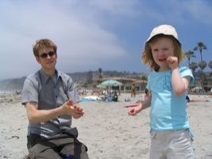
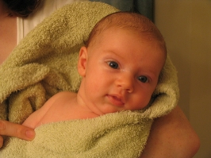

Title: Beach and Bath Photos
Date: 2004-06-27 19:08
Category: Family
Tags: Lauryn, Sophia

We had a busy day yesterday and a frustrating night the night before.

We've never owned our own television. We had loaners and old TVs, but
were never in a position to purchase our own. Friday night we decided it
was time, and ended up at Best Buy, ready to walk out with either a
Sharp 27" regular TV or a fancy Samsung HDTV. We decided against the
HDTV model because we figured HDTVs were going to improve (and come down
in cost) in the near future (as confirmed by [wikipedia](http://en.wikipedia.org/wiki/HDTV) later that night). So we moved to the till with our chosen TV.

 Neither would they take my starter cheque for my new account (the only
one with money at this point), nor a credit card imprint on that cheque.
And despite possession of a US Passport, the ultimate identification, we
couldn't even get a Best Buy credit card because I don't have a
state-issued drivers license.

 We walked out dejected and empty handed, but unsure if the TV would
have even fit in the car. *Grrr*.

 Saturday we wanted to go to the beach, but I but wanted to get a little
wetsuit with built in lifejacket for Lauryn from Costco and more memory
for the new camera. After the previous night's experience I knew I had
to get cash, so we packed up, made a trip to the bank, and headed over
to Costco.

 After grabbing the items we had come for, we walked through the TV
section and saw almost the same model TV that we'd tried to buy the
night before. This time we had the cash and were still adventuresome
enough to try and fit a new TV in the front seat of our car (sans boîte,
bien sûr).

 So we did it. I'm amazed that it fit (just barely) and I even took a
picture to remember our craziness. It didn't take long to drive home and
drop off the TV, followed by a trip for lunch at [Rubio's Fresh Mexican
Grill](http://www.rubios.com/) for some fish tacos and chicken burrito.

 Then, after being here for about three weeks, we finally made a daytime
trip to the beach [La Jolla Shores](http://www.sannet.gov/lifeguards/beaches/shores.shtml).

Lauryn was excited, but Sophia's hunger (and no reasonable place to feed
her as the feedings aren't without challenges yet...) kept us from
staying very long.

 Lauryn and I headed down to the water's edge, leaving Madge and
sleeping Sophia safely on the dry sand. I planned on dipping our toes in
the water to see if it was worth putting Lauryn in her new wetsuit, but
my plans aren't always the best.
	

 Shortly after getting our feet wet, and while looking down into the
water, a larger wave (still very small) threw Lauryn off balance,
plunging into the sandy surf. I popped her up and onto her feet as quick
as a flash, but the damage was done.

She was shocked, and had no idea what had happened. Seconds later Lauryn
realized that she was wet and, despite my efforts to convince her that
it was fine and that the water was nice, the coolness of the situation
made her want to go see Mom. We pulled off her wet clothes, dressed her
in a more appropriate fashion, and headed back to enjoy the water.

 We only spent a few more minutes before it was time to go, but the
weather was beautiful, the sand was warm, and the ocean wasn't cold.
We'll definitely have to go back.

 I have two new sets of pictures available of our [trip to Costco and
the Beach](), and a later set from [Sophia's bath]() that night.