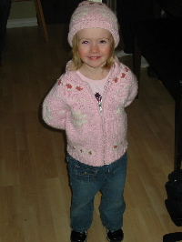

Title: Vocal Crossfading
Date: 2004-02-09 19:28
Category: Family
Tags: Lauryn

As a child I learned a song about springtime. It went like this:

> I looked out the window and what did I see?

> Popcorn popping on the apricot tree.

> Spring has brought me such a nice surprise,

> Blossoms popping right before my eyes...

 Shortly after meeting Madge she alerted me to a rather strange talent I
seem to have developed - the ability to crossfade between songs while
singing them. Or, in more clear terms, I could sing the first few lines
of one song and, without noticing, finish the verse by singing lyrics
from a completely different song. The most memorable example was the
mixing of "Popcorn Popping" and "Swing Low, Sweet Chariot," using the
lyrics below and to the tune of "Swing Low."

> I looked out the window and what did I see?
 
> Comin' for to carry me home.

> Popcorn popping on the apricot tree,

> Comin' for to carry me home..

 Its been fun to accidentally discover songs whose tunes easily blend
and are swappable, but today my daughter Lauryn showed that she has
inherited my talent.

Lauryn's Song

 (To the tune of Row Row Row Your Boat)
 Feb. 9, 2004

> Row row row your boat

> Gently down the stream.

> Mary Mary quite contrary

> How your garden grow?

