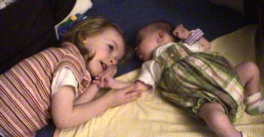
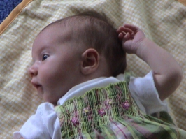

Title: Why Babies Should Be Born Bald
Date: 2004-06-15 19:44
Category: Family
Tags: Lauryn, Sophia

When our first daughter, Lauryn, was born, her thin blonde hair laid so
evenly on her head that for months people thought she was bald. Slowly
the hair grew and at one point there was a patch, at the back of her
head, of soft dirty-blonde hair that, if you blew on it just right,
looked like a cute mustache.

 Sophia, however, was born with a fair amount of soft dark hair. The
back half of her head has longer hair than the front, but no one could
claim that she's bald.

There's a downside to this situation, however. Up until about two days
ago, her longer hair laid flat and neat - smooth on top of her head.
When we decided that she'd probably enjoy spending some of her
active-awake time laying on a blanket, we witnessed the results of
Sophia's little hands discovering her own hair.

 With her head turned to the right, arms stretched up above her
shoulders, her left hand was perfectly positioned to touch and stroke
her soft locks. She seemed quite pleased with her discovery, but in the
process of enjoying the sensation, she "backcombed" her hair into a soft
fluff.

I've been told my hair, as a child, behaved in a similar fashion (only
standing on end), but in addition to perhaps a genetic predisposition,
Sophia assists the process.

 With touching comes grabbing, and Madge was required to intervene.
Sophia grabbed a chunk of her own fluff and pulled, making herself cry.
When the crying begins, she doesn't stop pulling and its necessary to
literally pry her hand open. At this point the crying ceases.

 Funny, funny kid. Makes herself cry and doesn't know why.
 
 So if you wish to avoid this same situation with your children, just
make sure they're born bald.
