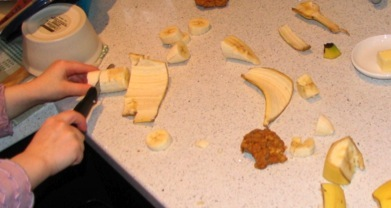

Date: 2007-12-07
Title: I can do it, Mommy
Slug: I-can-do-it-Mommy
Category: Family
Tags: Sophia

Here's my little girl, perfecting her culinary skills.  I do feel a *little* sorry for the banana...

At which age are children typically able to handle a knife?  She’s never cut herself, and I always try to keep an eye on her, but I can’t help but worry a bit.  They tell me Dave used to cut an apple on a stool with a sharp knife when he was about three.  It was a regular snack, but never as popular as the cheese sandwiches which he’d microwave on his own.

Its amazing how little ones can handle tools.  They learn by observation, and with a little instruction and supervision, its neat to see them succeed easily on their own.