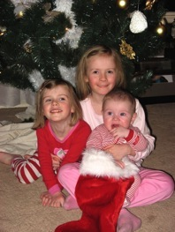

Date: 2007-12-28
Title: Merry Christmas!
Slug: merry-christmas
Category: Family
Tags: Lauryn, Sophia, Rhys

Christmas was great, and we were blessed to celebrate it with family and friends.  Its special to have a baby around at Christmastime.  Its fun to share his smiles and love with family, and to watch as new little eyes gaze at the lights on the tree.  You can’t help but wonder what they’re thinking as they stare and smile and take it all in.

Every night before bed we would read more about the Christmas story with our girls.  We also sang a Christmas carol with them each night, and they loved it.  They’re great little singers!

I can’t imagine what Christmas would be like without children.  They really make it memorable.  I love to see the gifts they give.  My oldest child made wonderful cards this year for everyone in the family.  The art was amazing and the messages were so sincere.  A gift seems so much better when you know you can’t purchase it at a store.

That brings me to the point of next Christmas.  I’m seriously considering a [Buy Nothing Christmas](http://adbusters.org/metas/eco/bnd/bnxmas/), where all gifts are hand-made, or simply gifts from the heart.  We’re all so wealthy in the global scheme of things; so few of us have unfulfilled needs.  Why should we go out and purchase unneeded *things* for each other? I hate to further fuel the consuming “machine”.  If any of us needs something, we’re likely to go and buy it.  And no, I’m not referring to *wants* here.  Anyway, its a plan and I’ll see how it goes.

A big thanks to Grandma & Grandpa for the sleepovers, the puzzles, the great food & even better company.

