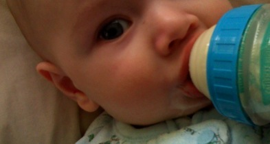
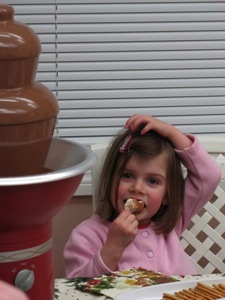

Date: 2008-1-1
Title: Happy 08!
Slug: happy-08
Tags: kids, family

Now we begin those first few marks on the blank page that is a brand new year.

If the Chinese have it right, this year should be a [lucky](http://en.wikipedia.org/wiki/Numbers_in_Chinese_culture) one.  Can we ALL have a really fortunate year at the same time?  Regardless, we wish you all a great one.  May you be happy and healthy and loved.

Looking back, we had a busy year.  Our major undertaking was the renovation of the entire main floor of our home.  We’re really enjoying it now and we find our kitchen to be much more functional & welcoming.

It was a big job, but a much more exciting event was just around the corner.  Our baby boy was born at the end of May.  He’s an absolute delight.  Life must not have been much fun before he came along.  His sisters adore and dote on him.  Lucky little man.

In November, Dave lost his Dad due to terminal illness. It was a sad and difficult time.  It was poignant and life-changing.  It was important to be there.  We dearly miss him, and we appreciate the love and support we’ve received from our family and friends.  He was truly one-of-a-kind and the closest replica exists only in the form of his two fine sons.

We were so happy to have Dave’s mom come for Christmas.  She is so sweet and a pleasure to have around.  We spent a lot of time at my parents’ place.  They know just how to make the holidays fun and they welcome everyone.

When Dave’s iPhone barked the toll of the new year, I was happy to have no regrets (other than my crummy Wii bowling score) and look forward with contentment.