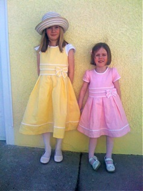
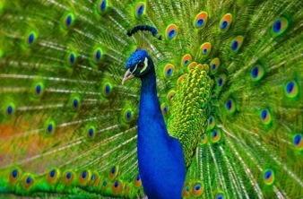

Date: 2008-4-27
Title: Scarrows & Peacons
Slug: scarrows-and-peacons
Tags: kids, family

Lauryn:   Oh, look!  A Robin!

Sophie:   We need to get the Biwd Book so we can see what kind of biwd it is.  It might be a scawwow.

Lauryn:   A scarrow?

Sophie:   Yeah.  A scawwow.  Or a peacon!

Lauryn:   A PEACON!!??

Sophie:   Yeah... scawwows and peacons.

Lauryn:   What's a peacon?

Sophie:   A peacon is a biwd that has long bwanches... and on the bwanches it has eyes!

